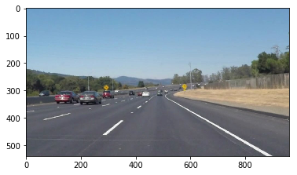
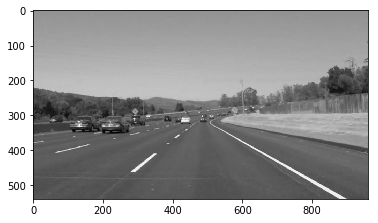
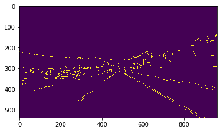
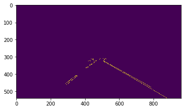
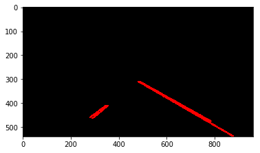
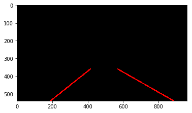
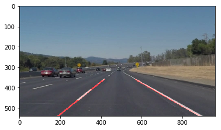

# **Finding Lane Lines on the Road** 
[](http://www.udacity.com/drive)


Overview
---

When we drive, we use our eyes to decide where to go.  The lines on the road that show us where the lanes are act as our constant reference for where to steer the vehicle.  Naturally, one of the first things we would like to do in developing a self-driving car is to automatically detect lane lines using an algorithm.

In this project you will detect lane lines in images using Python and OpenCV.  OpenCV means "Open-Source Computer Vision", which is a package that has many useful tools for analyzing images.  

Goals
---
- P1.ipynb  - pipeline that finds lane lines on the road [code](https://github.com/vinayakkankanwadi/CarND-LaneLines-P1/blob/master/P1.ipynb)
- README.md - written report to reflect the work [writeup](https://github.com/vinayakkankanwadi/CarND-LaneLines-P1/blob/master/README.md)

Reflection
---

Lane Finding Pipeline
---
Lane finding pipeline consisted of following steps:

Step0: Input Image 
---


Step1: Grayscale Image
---
Transform input image to a grayscale image for simpler edge detection


Step2: Gaussian Blur Image
---
Apply Gaussian blur on grayscale image to normalize noise and sharpness


Step3: Canny Image
---
Apply Canny Edge Detection algorithm to detect edges in the Gaussian blured image 


Step4: Region Mask Image
---
Apply Region of Interest mask to retain the road and remove others


Step5: Hough Segmented
---
Appply Hough transform we find line segments in the Region masked image.  The draw_lines() is default thus result images is segmented  


Step6: Hough Image
---
Modify using draw_lines() function we draw the lines on the frame inplace. "draw_lines()" takes all the lines found by the Hough transform, splits them into left/right line segments using their slope, averages multiple segments to get a single line each for left and right lane and extrapolates the line from bottom of ROI to the top. The function also performs a moving average over previously found line segments to smooth out the lane lines drawn.


Step7: Output Image
---
To get the final output superimpose the lane line image got from hough transform on the original image as it only contain lines highyed in red




Annotated Solid Lines Throughout Most Of The Video
---

Visually, the left and right lane lines are accurately annotated by solid lines throughout most of the video.

### SolidWhiteRight
```
https://github.com/vinayakkankanwadi/CarND-LaneLines-P1/blob/master/test_videos_output/solidWhiteRight.mp4
```

### SolidYellowLeft
```
https://github.com/vinayakkankanwadi/CarND-LaneLines-P1/blob/master/test_videos_output/solidYellowLeft.mp4
```

### Challenge
```
https://github.com/vinayakkankanwadi/CarND-LaneLines-P1/blob/master/test_videos_output/challenge.mp4
```


Potential Shortcomings
---
Current pipleline works well with the images and clips provided however has not been tested on other cases.
Even in current test images it does not look smooth on curves as it is just lines extrapolated.

Possible Improvements
---
Curve Line Needs improvement and Better algorithm can be applied to identify missing data than extrapolate lane lines.
